# fabaccess-config-generator <!-- omit from toc -->
Automatische Generierung von Maschinen, Rollen, Aktoren und Aktor-Verbindungen auf Basis einer Maschinenliste im CSV-Format.

- [Funktionsumfang](#funktionsumfang)
- [Funktionsweise](#funktionsweise)
  - [Bereichskonzept](#bereichskonzept)
  - [Rollenkonzept \& Berechtigungen](#rollenkonzept--berechtigungen)
  - [Beispielwerkstatt](#beispielwerkstatt)
    - [Auszug aus der CSV](#auszug-aus-der-csv)
    - [Werkstattdiagramm](#werkstattdiagramm)
    - [Erklärung der Konfiguration](#erklärung-der-konfiguration)
- [Nutzung des Python-Skripts](#nutzung-des-python-skripts)
  - [Anlegen von Maschinen (maschinenliste.csv)](#anlegen-von-maschinen-maschinenlistecsv)
  - [Einstellungen des Skripts (settings.ini)](#einstellungen-des-skripts-settingsini)
  - [Aktorenbibliothek (actors.ini)](#aktorenbibliothek-actorsini)
    - [Beispiel für die Erstellung eines Aktor-Typs](#beispiel-für-die-erstellung-eines-aktor-typs)
- [Verschiedene Informationen](#verschiedene-informationen)
  - [ID-Schema für Rollen, Maschinen und Aktoren](#id-schema-für-rollen-maschinen-und-aktoren)
    - [Ausnahme: Alternativrollen](#ausnahme-alternativrollen)
  - [Aktualisierung einer bestehenden bffh.dhall](#aktualisierung-einer-bestehenden-bffhdhall)


# Funktionsumfang
  - Generierung von Maschinen
  - Generierung von Rollen
  - Generierung von Aktoren
  - Generierung von einfachen Aktoren-Verbindungen
  - Export einer gesonderten Rollenliste (interne ID & Anzeigename der Rolle)
  - Abbildung der Struktur mittels Mermaid-Diagramm
  - Direkte Aktualisierung einer bestehenden `bffh.dhall`

# Funktionsweise
Die CSV-Zeile enthält pro Zeile einen Eintrag für eine Maschine. Neben Angaben zur Maschine selbst (ID, Wiki-URL etc.) werden Angaben zum Bereich vermerkt, in dem sich die Maschine befindet. Aus den Angaben zu den Bereichen werden dann alle Rollen abgeleitet.

## Bereichskonzept
Innerhalb der globalen Infrastruktur existieren die folgenden Einheit:
- **Domäne**: Fasst die gesamte Werkstatt zusammen und unterteilt sich in mehrere Bereiche (=Gewerke). Bei Bedarf können auch mehrere Domänen definiert werden.
- **Bereich**: Entspricht üblicherweise einem Gewerk (z.B. Holzwerkstatt, Siebdruck), aber kann auch genutzt werden, um andere Maschinen zu gruppieren (z.B. Eingangstüren). Ein Bereich kann bei Bedarf über Unterbereiche verfügen.
- **Unterbereich**: Ein Unterbereich ermöglicht einzelne Maschinen/ Maschinengruppen separat zu behandeln.

## Rollenkonzept & Berechtigungen
| Rolle           | Berechtigungen                                                         | Infrastruktur | Domäne   | Bereich | Unterbereich | Spezifische Maschinen |
| --------------- | ---------------------------------------------------------------------- | ------------- | -------- | ------- | ------------ | --------------------- |
| Administrator   | - *bffh.users.manage*<br> - *bffh.users.info*<br> - *bffh.users.admin* | Ja            | -        | -       | -            | -                     |
| Manager         | - *read*<br> - *write*<br> - *disclose*<br> - *manage*                 | -             | Optional | Ja      | Optional     | -                     |
| Benutzer        | - *read*<br> - *write*<br> - *disclose*                                | -             | -        | Ja      | Ja           | -                     |
| Alternativrolle | - *read*<br> - *write*<br> - *disclose*                                | -             | -        | -       | -            | Ja                    |

- Berechtigungen werden grundsätzlich via Wildcard vergeben und gelten somit für eine gesamte Einheit (Infrastruktur/ Domäne/ Bereich/ Unterbereich).
  - Berechtigungen für Bereich und Unterbereich sind getrennt. Benutzer eines Bereichs haben keinen Zugriff auf Maschinen eines Unterbereichs (und umgekehrt).
- **Ausnahme: Alternativrolle**
  - Die Alternativrolle dient der Erstellung einer bereichsübergreifenden Berechtigung für einzelne Maschine. Diese wird vergeben, wenn in mehreren Bereichen die gleiche (bzw. eine ähnliche) Maschinen existieren und dafür nur eine Einweisung notwendig ist.

## Beispielwerkstatt

Die CSV-Datei `beispielwerkstatt.csv` und das Diagramm `beispielwerkstatt.svg` befinden sich im Unterordner `docs`.

### Auszug aus der CSV

| Name Domäne       | Name Bereich    | Name Unterbereich | Name Maschine       | Manager Unterbereich | Name Alternativrolle |
| ----------------- | --------------- | ----------------- | ------------------- | -------------------- | -------------------- |
| Beispielwerkstatt | Holzwerkstatt   | Bandsäge          | Bandsäge            |                      |                      |
| Beispielwerkstatt | Holzwerkstatt   | Hobelmaschine     | Hobelmaschine       |                      |                      |
| Beispielwerkstatt | Holzwerkstatt   | CNC-Fräse         | CNC-Fräse           |                      |                      |
| Beispielwerkstatt | Holzwerkstatt   |                   | Kappsäge            |                      |                      |
| Beispielwerkstatt | Holzwerkstatt   |                   | Bandschleifer       |                      |                      |
| Beispielwerkstatt | Holzwerkstatt   |                   | Ständerbohrmaschine |                      |                      |
| Beispielwerkstatt | Textilwerkstatt |                   | Nähmaschine 1       |                      |                      |
| Beispielwerkstatt | Textilwerkstatt |                   | Nähmaschine 2       |                      |                      |
| Beispielwerkstatt | FabLab          | 3D-Druck          | 3D-Drucker 1        | x                    |                      |
| Beispielwerkstatt | FabLab          | 3D-Druck          | 3D-Drucker 2        | x                    |                      |
| Beispielwerkstatt | FabLab          | Laser             | Lasercutter         | x                    |                      |
| Beispielwerkstatt | FabLab          | Laser             | Kühlung             | x                    |                      |
| Beispielwerkstatt | Siebdruck       |                   | SD-Belichter        |                      |                      |
| Beispielwerkstatt | Siebdruck       |                   | A3-Drucker          |                      | Druckernutzung       |
| Beispielwerkstatt | Büro            |                   | Drucker             |                      | Druckernutzung       |


### Werkstattdiagramm



### Erklärung der Konfiguration
- **Textilwerkstatt**
  - In der Textilwerkstatt verwaltet eine Person den gesamten Bereich.
  - Eine Einweisung deckte alle Maschinen ab, daher gibt es keine Unterbereiche.
- **Holzwerkstatt**
  - In der Holzwerkstatt verwaltet eine Person den gesamten Bereich.
  - Es gibt unterschiedliche Einweisungen:
      - Holzwerkstatt Allgemein (Kappsäge, Bandschleifer, Ständerbohrmaschine)
      - Bandsäge
      - Hobelmaschine
      - CNC-Fräse
  - Bandsäge, Hobelmaschine, CNC-Fräse verfügen jeweils über einen eigenen Unterbereich, um für jede Maschine eine eigene Berechtigung vergeben zu können.
- **FabLab**
  - Im FabLab sind mehrere Personen für die Verwaltung zuständig:
      - Person A ist im Allgemenien für das FabLab zuständig. Hier gib es keine Maschinen, die von von FabAccess verwaltet werden.
      - Person B ist für die 3D-Drucker zuständig.
      - Person C ist für den Lasercutter inkl. Kühlung zuständig.
  - Beide Maschinengruppen (3D-Drucker & Laser) sind in einem eigenen Unterbereich, um eine eigene Berechtigung vergeben zu können.
  - Beide Unterbereiche verfügen über einen Unterbereich-Manager, damit Person A und B ihren jeweiligen Bereich verwalten können.
- **Siebdruck & Büro**
  - Es gibt eine allgemeine Drucker-Einweisung, die zur Nutzung aller Drucker in beiden Bereichen berechtigt. Die Drucker der beiden Bereiche sind mit der Alternativrolle _Druckernutzung_ verknüpft.


# Nutzung des Python-Skripts
- Eingelesen wird die Datei `maschinenliste.csv` [^1]
  - Die Spaltennamen dienen der Zuordnung und dürfen nicht umbenannt werden.
  - Die Reihenfolge der Spalten kann nach Belieben verändert werden.
- Zentrale Einstellungen können in der `settings.ini` vorgenommen werden,
- Aktor-Typen können in der `actors.ini` definiert
- Erzeugte Daten werden im Unterordner `output` gespeichert.

[^1]: Die Datei muss in der Enkodierung UTF-8 (ohne BOM) vorliegen.

## Anlegen von Maschinen (maschinenliste.csv)
- Verwendetes Trennzeichen: `;`
- IDs können Buchstaben und Zahlen enthalten.
  - Alle Großbuchstaben werden automatisch in Kleinbuchstaben umgewandelt.
  - Deutsche Sonderzeichen werden automatisch umgewandelt (ä = ae, ö = oe, ü = ue, ß = ss).
  - Alle übrigen Zeichen werden automatisch entfernt.


| Feld                     | Info                                                                  | Pflichtfeld |
| ------------------------ | --------------------------------------------------------------------- | ----------- |
| **ID Domäne**            | Eindeutige ID einer Domäne.                                           | Ja          |
| **ID Bereich**           | Eindeutige ID eines Bereichs.                                         | Ja          |
| **ID Unterbereich**      | Eindeutige ID eines Unterbereichs.                                    | -           |
| **ID Maschine**          | Eindeutige ID der Maschine.                                           | Ja          |
| **Unterbereich Manager** | Erstellung einer Manager-Rolle für den dazugehörigen Unterbereich     | -           |
| **Name Bereich**         | Anzeigename des Bereichs.                                             | Ja          |
| **Name Unterbereich**    | Anzeigename des Unterbereichs.                                        | -           |
| **Name Maschine**        | Anzeigename der Maschine.                                             | Ja          |
| **Maschinbeschreibung**  | Feld `description` einer Maschine in FabAccess.                       | -           |
| **Wiki-URL**             | Feld `wiki` einer Maschine in FabAccess.                              | -           |
| **Aktor ID**             | Eindeutige ID eines Aktors.                                           | -           |
| **Aktor Typ**            | Definiert den Aktorentyp, der aus der Aktorenbibliothek geladen wird. | -           |
| **ID Alternativrolle**   | Eindeutige ID einer alternativen Rolle.                               | -           |
| **Name Alternativrolle** | Anzeigename einer alterantiven Rolle.                                 | -           |
| **Anmerkungen**          | Zusatzfeld für Anmerkungen, wird nicht verarbeitet.                   | -           |

Hinweis zum Feld `Unterbereich Manager`:
- Für die Erstellung der Rolle muss eni Unterbereich  definiert sein.
- Das Feld wird aktiv sobald ein beliebiger Inhalt eingetragen wird.
- Das Feld muss nur für eine Maschine des Unterbereichs ausgefüllt werden.

## Einstellungen des Skripts (settings.ini)
| Einstellung                | Info                                                                                                           |
| -------------------------- | -------------------------------------------------------------------------------------------------------------- |
| **multi_domains**          | Verwendung mehrer Domänen. Es wird dann automatisch eine Manager-Rolle für jede Domäne erstellt.               |
| **manager_schichtleitung** | Rolle "Schichtleitung" erstellen, die über Manager-Berechtigungen für alle Domänen verfügt.                    |
| **manager_area**           | Manager-Rolle für jeden Bereich erstellen.                                                                     |
| **manager_subarea**        | Spalte "Unterbereich Manager" der CSV beachten (True) oder nicht (False).                                      |
| **fa_update_dhall**        | Automatische Aktualisierung einer bestehenden `bffh.dhall`.                                                    |
| **fa_dhall_file**          | Pfad zur bffh.dall.                                                                                            |
| **generate_mermaid**       | Mermaid-Code erzeugen, der Bereiche und Rolle in einem Diagramm abbildet. [^2]                                 |
| **create_file_roles**      | Erstellung einer gesonderten CSV-Datei, die jede Rollen-ID und den dazugehörigen Rollen-Name beinhaltet.       |
| **show_machines**          | Alle importierten Maschinen-Daten anzeigen.                                                                    |
| **show_roles**             | Alle erzeugten Rollen-Daten anzeigen.                                                                          |
| **string_adminhandle**     | Kennzeichnung von Administrator-Rollen im Anzeigename. Der String wird dem Namen der Rolle vorangestellt. [^3] |
| **string_managerhandle**   | Kennzeichnung für Manager-Rollen, steht am Anfang des Namens der Rolle. [^3]                                   |
| **string_userhandle**      | Kennzeichnung von Benutzer-Rollen im Anzeigename. Der String wird dem Namen der Rolle vorangestellt. [^3]      |

[^2]: Ausgabe erfolgt in die Datei `mermaid-code.txt`. Der enthaltene Code kann auf [mermaid.live](https://mermaid.live/) eingefügt werden, um das Diagramm als Grafik zu speichern.
[^3]: Der Anzeigename wird aktuell nur im Diagramm verwendet.


## Aktorenbibliothek (actors.ini)
In der Aktorenbibliothek können Vorlagen für Aktor-Typen angelegt werden. Ein bestimmter Aktor muss somit nur einmal angelegt werden und kann in der `maschinenliste.csv` angegeben werden.

Ein Aktor-Typ besteht immer aus:
- Titel des Aktors. Dieser wird in eckigen Klammern angegeben und definiert den Aktor.
- Angabe zum Feld `module` von FabAccess.

Darüber hinaus können beliebig viele eigene Parameter übergeben werden. Diese müssen mit Präfix `param_` als Parameter gekennzeichnet sein.


### Beispiel für die Erstellung eines Aktor-Typs
Angelegt wird der Aktor *shellyplus*. Für diesen wird anschließend in der  `maschinenliste.csv` eine Maschine mit der Aktor-ID *test12345* angelegt.

> Groß- und Kleinschreibung spielt für die Datenverarbeitung keine Rolle. Sowohl der Aktor-Name als auch alle Parameter werden automatisch in Kleinbuchstaben umgewandelt.
<br/>

Aktor-Definition in der actors.ini
```
[shellyplus]
module = "MqttSwitch"
param_topic = "shellyplus1pm-$actor_id/rpc",
param_onMsg = "{\"id\": 1, \"src\": \"bffh\", \"method\": \"Switch.Set\", \"params\": {\"id\": 0, \"on\": true}"
param_offMsg= "{\"id\": 1, \"src\": \"bffh\", \"method\": \"Switch.Set\", \"params\": {\"id\": 0, \"on\": false}"
```
<br/>

Fertiger Aktor in der `bffh.dhall`:
```
shellyplus_test12345 =
{
    module = ""MqttSwitch"",
    params =
    {
        topic = "shellyplus1pm-bbbb/rpc",,
        onmsg = "{\"id\": 1, \"src\": \"bffh\", \"method\": \"Switch.Set\", \"params\": {\"id\": 0, \"on\": true}",
        offmsg = "{\"id\": 1, \"src\": \"bffh\", \"method\": \"Switch.Set\", \"params\": {\"id\": 0, \"on\": false}",
    }
},
```


# Verschiedene Informationen
## ID-Schema für Rollen, Maschinen und Aktoren
| ID           | Schema                                                    |
| ------------ | --------------------------------------------------------- |
| **Rolle**    | domäne.bereich.bereich.rollentyp bzw. domäne.unterbereich.rollentyp |
| **Maschine** | domäne-bereich-bereich-maschinen bzw. domäne-unterbereich-maschinen |
| **Aktor**    | aktortyp_aktorid                                          |

**Auszug aus der Beispielwerkstatt: Unterbereich FabLab Laser**
- Rolle "*Manager FabLab Laser*": beispielw_fablab_laser_manager
- Rolle "*Benutzer FabLab Laser*": beispielw_fablab_laser_user
- Maschinen-IDs:
  - Maschine "*Lasercutter*": beispielw-fablab-laser-laser3000
  - Maschine "*Kühlung*": beispielw-fablab-laser-kuehlung3000

### Ausnahme: Alternativrollen
Bei einer Alternativrolle weicht die Rollen-ID von der Maschinen-ID ab, da es sich um eine bereichsübergreifende Rolle handelt. Die Rollen-ID beinhaltet keine Bereichszuordnung. Die Maschinen-ID beinhaltet nach wie vor eine Bereichszuordnung, um die Maschine eindeutig in der Werkstatt verorten zu können.

**Auszug aus der Beispielwerkstatt: Alternative Rolle für Druckernutzung**
- Rolle "*Benutzer Druckerbenutzung*": beispielw_drucker
- Maschinen-IDs:
  - beispielw-siebdruck-a3drucker
  - beispielw-buero-drucker

## Aktualisierung einer bestehenden bffh.dhall
Eine bestehende `bffh.dhall` kann auf Wunsch automatisch aktualisiert werden. Dabei wird der Inhalt der bestehenden `bffh.dhall` eingelesen und die vom Config-Generator erzeugten Daten an einer vordefinierten Stelle eingesetzt.

**Einstellungen in der settings.ini setzen**
Hierfür müssen in der `settings.ini` die folgenden Einstellungen gesetzt sein:
- `fa_update_dhall`auf `True`
- `fa_dhall_file` muss die Pfandangabe zur bffh.dhall enthalten

**bffh.dhall vorbereiten**
1. Bestehende Datenstrukturen löschen:
   - roles
   - maschines
   - actors
   - actor_connections
2. Die folgenden Zeilen einfügen.
    - `-- ||| GENERATOR START`
    - ` -- ||| GENERATOR END`

Das Skript fügt die erzeugten Daten automatisch zwischen beiden Platzhaltern ein. Bestehender Inhalt zwischen den Platzhaltern wird dabei überschrieben.

> &nbsp;
> **Hinweis**
> Ein Vorlage für eine entsprechend angepasste `bffh.dhall` befindet sich im Unterordner `docs`
> &nbsp;